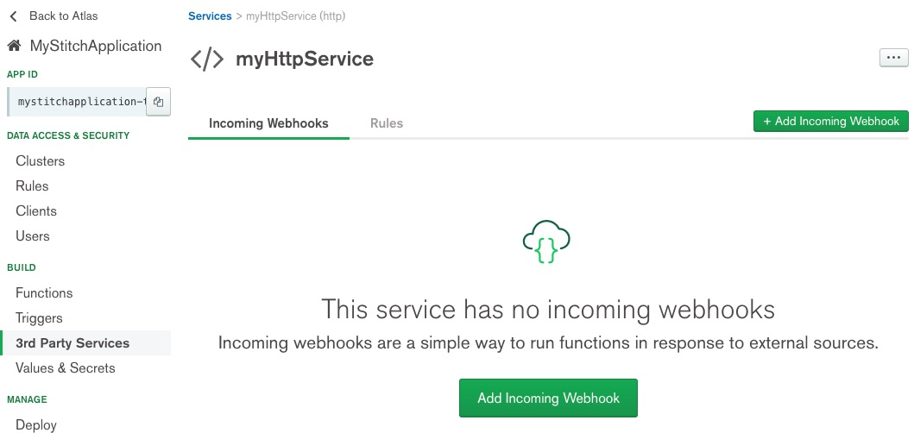
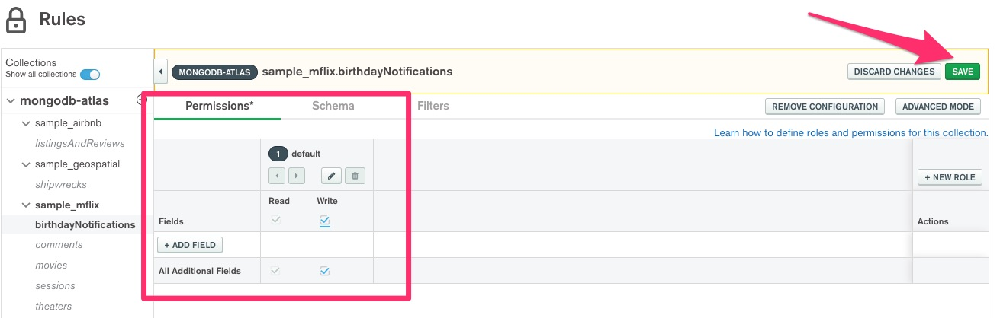
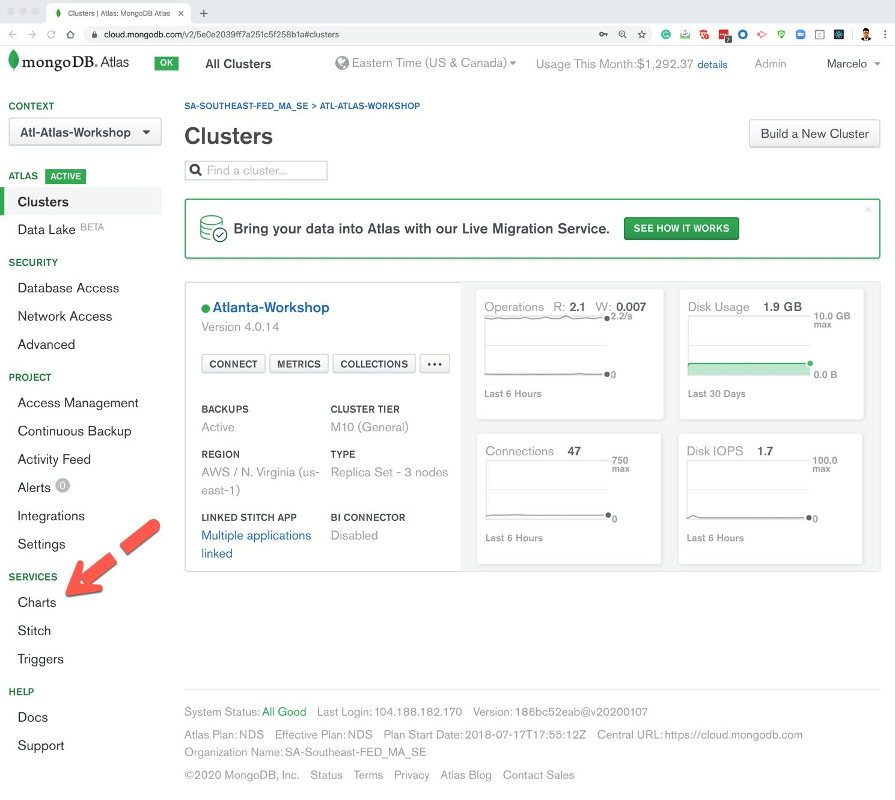

# Atlanta MongoDB Atlas Workshop at TechRise
The purpose of this repository is to support the MongoDB Atlas Workshop in Atlanta coming January 15, 2020.  If you are interested in participating, please be sure to register
for the [Atlanta MongoDB Atlas Workshop at Techrise](https://atlmdbatlasworkshoptechrise.splashthat.com/). 


---

## Introduction to MongoDB and MongoDB Atlas
### Hands-on Workshop
#### Overview


#### Required Prerequisites

* To use MongoDB Atlas, you **must** be able to make outgoing requests from your computer
to MongoDB Atlas services which will be running on port 27017.  Please confirm that port
27017 is not blocked by checking with [PortQuiz](http://portquiz.net:27017/).

* Complete [Getting Started with MongoDB Atlas](https://docs.atlas.mongodb.com/getting-started/). This involves creating an Atlas account, creating your first
free tier cluster, and setting up the appropriate security credentials

* Load Sample data into your cluster by following the [Insert and View Data in Your Cluster](https://docs.atlas.mongodb.com/tutorial/insert-data-into-your-cluster/)
section of the Getting Started Guide.

* Download/Install [MongoDB Compass](https://www.mongodb.com/products/compass).  At the moment,
the most recent version of MongoDB Compass is 1.20.4 (Stable).

* Verify the sample databases/collections have been successfully loaded into your
MongoDB Atlas cluster by using either MongoDB Compass or the [Data Explorer](https://docs.atlas.mongodb.com/data-explorer/index.html)
tool that is part of the MongoDB Atlas User Interface.

---

### Outline of Workshop:

1.  Deploy a MongoDB Atlas Cluster
    * Create MongoDB Atlas Account
    * Create cluster
    * Load/View data in MongoDB Sandbox Cluster
    
2.  Query and Manage Data
    * MongoDB Compass
    * Query Performance/Indexes (includes Performance Advisor Demo)
    * Aggregation Framework Example
    
3.  MongoDB Atlas Operations
    * Continuous Backup
    * Cluster Snapshots
    * Demo of Point-in-Time restore
    
4.  MongoDB Stitch
    * Webhooks
    * Triggers
    * Query Anywhere
    
5.  MongoDB Charts

6.  Code Samples

---

# MongoDB Atlas Workshop 

## 1.  Deploy a MongoDB Atlas Cluster 
### Lab 1
Complete the required prerequisites at the top of this page.

---

## 2.  Query and Manage Data 
### Lab 1 - MongoDB Compass 
#### Connect to your cluster in MongoDB Atlas
If you have completed the steps above, we can now copy the connection string and connect MongoDB Compass
to our cluster.  Within the Atlas UI, in the Clusters view, click the **Connect** button.  This will display
a pop-up window where you can select how to connect to your Atlas Cluster.  Select the option
**Connect with MongoDB Compass**.  The image below should provide an idea on what you should see:

  

Be sure to select that you already have MongoDB Compass and select the latest version which is indicated by
**1.12 or later**.  Then, copy your connection string to paste into MongoDB Compass.  All you should have to do is enter the
password you used when you first created a MongoDB Atlas database user or Atlas Admin user.  Be sure to select this
as a favorite as this makes it much quicker to open the database when you re-open MongoDB Compass.  It should
look similar to that below:

  

Once you have successfully authenticated to MongoDB Atlas through MongoDB Compass, you should be presented
with a screen similar to that below:


#### Browse Documents
Click the **sample_mflix** database to open  up a series of collections.  Then, select the **theaters** collection.  It
should have a list of the documents similar to that below:  

  

There is simply an **_id** field, a **theaterId** field, and a **location** object.  Wait, did we just store an object in the 
database?  We can expand the location field/object and see it is storing an address and embedding yet another object for
its geolocation.  Working with data in this way, it is much easier than having to flatten out multiple tables from a 
relational/tabular model in a single object.  

#### Analyze the Schema 
Analyze the schema??? Wait, I thought that MongoDB was a NoSQL database and was considered to be schema-less? While that
is technically true, no dataset would be of any use without the notion or concept of a schema. Although MongoDB does not
enforce a schema, your collections of documents will still always have one. The key difference with MongoDB is that the
schema can be flexible/polymorphic.  

Within MongoDB Compass, select the **Schema** tab and click **Analyze Schema**.  MongoDB Compass will sample the
documents in the collection to derive a schema.  In addition to providing field names and types, MongoDB Compass
will also provide a summary of the data values and their distribution.

After you click **Analyze Schema**, if you inspect the **location** field, you will notice that it contains a 
**geo** field with GeoJSON coordinates, i.e. a longitude and latitude coordinate.  You can drill down on the
map as it builds out a query for you.  It should resemble the image below:  

  

#### Query Data with MongoDB Compass (CRUD Operations) 
Simply copy the code block for each section below and paste within the filter dialog in MongoDB Compass
as indicated below.  Please pay close attention to the database/collection you have selected.  The various options
can be expanded by clicking the **Options** button.


##### Find Operations
* Simple filter (specific name in sample_mflix.comments collection) 

```
{ name : "Ned Stark" }
```

* Simple filter with query operators (email that ends in fakegmail.com and comment made since 2017 in sample_flix.comments) 
```
{ email: /fakegmail.com$/ , date : {$gte : ISODate('2017-01-01')}}
``` 

* Query sub-document/array (movies with more than 10 wins in sample_mflix.movies) 
```
{"awards.wins" : {$gt : 10}} 
``` 

* Query using the $in operator (Movies in Arabic or Welsh in sample_mflix.movies) 
```
{languages : {$in : ["Arabic", "Welsh"]}} 
``` 

* Only movies in Arabic 
```
{languages : ["Arabic"] } 
``` 

* Movies in BOTH Arabic and Spanish 
```
{languages : { $all : ["Arabic", "Spanish"]}}
``` 

* Movies with IMDB Rating > 8.0 and PG Rating 
```
{"imdb.rating": {$gt : 8.0 }, rated : "PG"} 
``` 
* Movies with Title starting with "Dr. Strangelove" 
```
{ title : /^Dr. Strangelove/ } 
``` 

##### Update, Delete, Clone Operations 
Find a document in any collection and choose to update a field or fields. In fact, you can select to add a field that
does not exist. Next, clone a document. Then, delete the cloned document. MongoDB Compass provides all the CRUD 
controls you will need. Below is a sample image displaying where this capability is:

 


### Lab 2 - Query Performance/Indexes
#### Create Indexes to Improve Efficiency of Queries

Indexes support the efficient execution of queries in MongoDB. Without indexes, MongoDB must perform a 
**collection scan**, i.e., scan every document in a collection to select those documents that match the query 
statement. If an appropriate index exists for a query, MongoDB can use the index to limit the number of documents it 
must inspect.

In this lab, we will perform a search on a field, use the explain plan to determine if it could be improved 
with an index, and create the index...all from within MongoDB Compass.

For this lab, we will execute a query to find all movies with at least Drama as a genre.  Again, remain
in the **sample_mflix** database within the **movies** collection.

In the query box, enter:
```
{genres : "Drama" } 
```
Then, click the *Explain Plan** tab as indicated below: 
 

Click the **Execute Explain** button in the middle of the GUI and review the output.

 

Considering this is a relatively small data size, an index may not immediately improve performance.  In our results, it 
indicates a **collection scan** took place with our filter.  It also indicates the Actual Query Execution Time was 17ms.

Click on the **Indexes** tab.  We will create an index on **genres**.  Find the field in the dropdown and select 'asc'
as the index type.  Then, click the create button as indicated below.

  

After creating the index, go back to your **Explain Plan** tab and **Execute Explain** once more.  This time, you should 
see that your index was used and instead of a collection scan, your filter performed an **index scan**.  Your results 
should look similar to that below. 

 

#### Performance Advisor Demonstration
The [Performance Advisor](https://docs.atlas.mongodb.com/performance-advisor/) monitors queries that MongoDB considers 
slow and suggests new indexes to improve query performance.  The Performance Advisor recognizes a query as slow if it 
takes longer than **100 milliseconds** to execute.  The Performance Advisor does NOT negatively affect the 
performance of your Atlas clusters.

In order to demonstrate the Performance Advisor, we need to generate some poor performing queries against our 
sample dataset within MongoDB Atlas.  We will take advantage of a project built specifically for generating slow running
queries on our sample dataset, [https://github.com/robbertkauffman/mdb-slow-running-queries](https://github.com/robbertkauffman/mdb-slow-running-queries).  

For purposes of the demonstration, a MongoDB Stitch application was created and is utilizing a Scheduled Trigger to generate
a random poor performing query against our sample dataset.  While the Performance Advisor is scanning the logs, 
we can take a look at the [MongoDB Atlas Query Profiler](https://docs.atlas.mongodb.com/tutorial/profile-database/).  This
tool provides the ability to diagnose and monitor performance issues.  For example, the image below
was taken while the slow running queries were executed to illustrate the metrics that can be reported.

  

 

### Lab 3 - Aggregation Framework Example 
MongoDB's [Aggregation Framework](https://docs.mongodb.com/manual/core/aggregation-pipeline/) is modeled on the concept
of data processing pipelines.  Documents enter a multi-state pipeline that transforms the documents into an aggregated
result.  For our next exercise, we will use the aggregation pipeline builder in MongoDB Compass to create an
aggregation pipeline.

We have been tasked with determining the most popular genres of movies that have been produced in the USA, Germany, and
France since the year 2000.  Click on the **Aggregations** tab.  It should look similar to that below.

  

First, our pipeline will need to filter for movies with a country of USA, France, and Germany and have been produced since
the year 2000.  This will be done with a **$match** operation.  In the first stage of the pipeline
builder, select **$match** from the dropdown and paste the following:
```
{
  countries : ["USA", "Germany", "France"],
  year : {$gt : 2000 }
}
``` 

MongoDB Compass should look similar to that below. 

  

You should observe that a preview of sample documents is on the right-hand side of the builder.  Now, we want to unwind
the genres array as we want to count the most popular genres.  The next stage will be an **$unwind** operation on genres.
Paste the following in the $unwind stage.
```
{
    path: "$genres"
}
``` 

Now, we want to group by the genres and count them.  This is done with the **$group** operator and the **$sum** operator.
Copy/Paste the snippet below into the $group stage.
```
{
  _id: "$genres",
  genre: {
    $sum: 1
  }
}
``` 

Finally, we will want to sort the result in a descending fashion so the most popular genre is the first element of our result.
Can you figure out how to do that?  As a hint, the final overall pipeline will be the snippet that follows.
```
[
    {
        $match: {
            countries : ["USA", "Germany", "France"],
            year : {$gt : 2000 } }}, 
        { $unwind: { path: "$genres" }}, 
        { $group: { _id: "$genres",
                   genre: { $sum: 1 } }}, 
        { $sort: { "genre": -1 }
    }
]
```
This pipeline can then be saved if you would like to use it again at a later time.


---

## 3.  MongoDB Atlas Operations 
### Lab 1 - Continuous Backup

### Lab 2 - Cluster Snapshots 

### Lab 3 - Point-in-Time Restore

---

## 4.  MongoDB Stitch
[MongoDB Stitch](https://docs.mongodb.com/stitch/) is a serverless platform that enables developers to quickly build applications
without having to set up server infrastructure.  Stitch is built on top of MongoDB Atlas enabling it to
automatically integrate the connection to your database.

In this section of the Atlas Workshop, we will create our first MongoDB Stitch application in order to expose our
sample data through a RESTful endpoint. 

### Lab 1 - Webhooks
Our first step in exposing our sample data via a REST endpoint or rather a webhook is to create a MongoDB
Stitch application.  First, click the **Stitch** menu option within our MongoDB Atlas UI in the lower left-hand
section of the navigation.  Once this is clicked, then you will need to click the button **Create New Application**.
We will name our application MyStitchApplication and we will keep the existing default selections.  Your UI should
look like that below.  If it does, continue by clicking the **Create** button.

 

#### Create Stitch Function 
We have performed a number of exercises with the **sample_mflix** database.  Within this database, there is a **users**
collection.  If you have inspected this collection, you may have noticed that there is a unique index on the email field.  
If we wanted to query for unique document, it would make sense that we will need to be able to retrieve a document based
on the email field.  Let's create a function to find a user by their email.

We will need to select the **Functions** option from the left-hand navigation and then click the **Create New Function**
button as indicated below.

 

When the function editor opens, you should name your function **getUserByEmailFunction**.  Keep the remaining defaults.
Your function settings should look like that below.  When it does, click the **Save** button in the bottom-right corner.

  

After saving, the Function Editor will open.  Copy and paste the code snippet below and click the **Save** button.
```
//
// To test in console: exports('aidan_gillen@gameofthron.es')
//
exports = async function(arg) {
  
  console.log("Calling getUserByEmail Function.");
  console.log("Find by email: " + arg);

  var usersCollection = context.services.get("mongodb-atlas").db("sample_mflix").collection("users");
  
  const query = { "email": arg };

  return usersCollection.findOne(query)
    .then(result => {
      if(result) {
        console.log(`Successfully found document: ${result}.`)
        return result;
      } 
      else {
        console.log("No document matches the provided query.")
        return {"Result" : "No document matches the provided id: " + arg}
      }
    })
  .catch(err => console.error(`Failed to find document: ${err}`))
};
``` 
Once the code has been pasted and saved, we can run a quick smoke test of our function.  In the comment section at the
top of the code snippet, you can copy and paste in the Console tab at the bottom of the screen.  Remove the 'Hello World' 
snippet in the console that is placed there by default.  It should look similar to this below after your edit.

 

Click the **Run** button as indicated in the image above and the **Result** tab should become enabled with a result.
If your test is successful, be sure to click the **Review & Deploy Changes** button at the top of the page.  It should
look like the image below.

 

The **Review & Deploy Changes** dialog will appear.  Simply click the **Deploy** button in the lower-right corner.


#### Create HTTP Service
Now that we have successfully tested our function, let's create an HTTP Service so we can interface with it via REST.
First, click the **3rd Party Services** option in the left-hand navigation then the **Add a Service** button in the
center of the page as indicated below.

 

Select **HTTP** from the Service options.  Name the service **myHttpService**.  
 

Now, we will want to **Add Incoming Webhook**.  
 

Name the webhook **getUserByEmailWebhook**. Select **GET** as the HTTP Method.  Keep the remaining defaults similar
to that below.

 
 

The Function Editor for our webhook will open.  Recall that earlier we create a function to find a user by their email.
We will now interface with that function from our webhook.  Copy the code snippet below and paste into the function
editor over the default code that is placed there.
```
// This function is the webhook's request handler.
//
// To test: exports({query: {email: 'sean_bean@gameofthron.es'}})
exports = async function(payload, response) {
  
  console.log("Executing Webhook getUserByEmail.");
  
  // Query params, e.g. '?arg1=hello&arg2=world' => {arg1: "hello", arg2: "world"}
  const {email} = payload.query;
  
  console.log("Query arg: " + email);
  
  // Calling a function:
  return await context.functions.execute("getUserByEmailFunction", email);
};
```

If you would like to quickly test this function, you can use the snippet that is in the comment section of the pasted
code.  You will test it in exactly the same manner as we tested the earlier function that was created.  If your test
is successful, let's interface with our REST API from a 3rd party tool!  Be sure to **Review & Deploy Changes** prior
to testing externally!!!

#### Test the GET Webhook
Since this is a REST-based API, we can basically use just about any tool that we are comfortable with.  For example, one
could test with a Python script, the command-line utility curl, or [Postman](https://www.getpostman.com/).

MongoDB Stitch makes this incredibly easy.  If you click on the **Settings** tab for our webhook, it will provide the
Webhook URL.
 

After you copy the Webhook URL, you can use your tool of choice.  Be sure to include the proper query parameter to the
end of the request.  Our parameter is named **email** as defined in our Webhook Function.  An example would be:
```
email=sean_bean@gameofthron.es
```
Once you have the parameter defined, you can now test the GET service of your webhook.  An example curl command and
result are provided below.  This exact command will NOT work for you as your Webhook URL will be entirely different!
```
curl https://webhooks.mongodb-stitch.com/api/client/v2.0/app/mystitchapplication-tlpid/service/myHttpService/incoming_webhook/getUserByEmailWebhook\?email=sean_bean@gameofthron.es
{"_id":{"$oid":"59b99db4cfa9a34dcd7885b6"},"name":"Ned Stark","email":"sean_bean@gameofthron.es","password":"$2b$12$UREFwsRUoyF0CRqGNK0LzO0HM/jLhgUCNNIJ9RJAqMUQ74crlJ1Vu"}
```
#### Create POST Webhook
Not only will we require the ability to find existing users, we will want to add or POST new users to our users collection.
In order to do this, we will need an additional Webhook.  We will follow the same pattern as we did for the GET Webhook
created in an earlier step.  Again, click the **3rd Party Services** menu option in the left-hand navigation.  You
should see your existing myHttpService that was created earlier.  Select or drill-down into the service.  There will
be a listing of the **Incoming Webhooks**.  In particular, you should see the **getUserByEmailWebhook**.

Click the button for **+ Add Incoming Webhook**.  Name the webhook **postNewUserWebhook**.  Keep the same defaults as
the GET webhook created earlier except be sure to select the **POST** HTTP method.  Save the webhook and the 
Function Editor will open.  Paste the code snippet below over the default code provided in the editor.
```
//
exports = async function(payload) {
  console.log("Executing New User Webhook.");
  
  //Accessing a mongodb service:
  var collection = context.services.get("mongodb-atlas").db("sample_mflix").collection("users");
    
  var payloadBody = EJSON.parse(payload.body.text());
  
  if(payloadBody) {
    
      // create the new user document
      // email is a unique index so it must be unique
      var userDocument = {
        name       : payloadBody.name,
        email      : payloadBody.email,
        password   : payloadBody.password,
        birthdate  : new Date(payloadBody.birthdate),
        updatedate : new Date()
      };
      
      // insert the new user - use await to make sure it is inserted prior to finding it!
      await collection.insertOne(userDocument).then(result => {
        const {insertedId} = result;
        console.log(`Inserted new user with _id: ${insertedId}`);
      });
      
      // Let's return the complete new user document
      return await context.functions.execute("getUserByEmailFunction", payloadBody.email);
  }
  else {
    return {"Result" : "Invalid payload body."};
  }
      
};
```
After saving the function, be sure to **Review & Deploy Changes** and then click the **Deploy** button.

If you inspect the code, you will find that the webhook function will take the payload body and parse out the JSON.  Recall
that the email address we use must be unique or the database will throw an error.  We will add an additional **updatedate**
field as well.  Then, we insert this JSON and return the inserted document (did you remember to return a result in your
webhook settings!) using the function we created earlier.

#### Test the POST Webhook
We have already tested our API using the GET HTTP method.  We will follow the same method to test our POST.  Once again,
open the Settings of our POST webhook to find the associated URL.

We will test with curl once more.  To make things a bit easier, below is the JSON document you can use to test with.
```
{ 
    "name":"My New User", 
    "email":"myNewUserEmail", 
    "password":"mySecurePassword", 
    "birthdate":"2001-06-13"
}
```
In order to test with curl, you will need to be sure to include the Content-Type.  An example POST with result is below.
If you are using Postman to test, it is even easier!
```
curl -H "Content-Type: application/json" \
> -d '{ "name":"My New User", "email":"myNewUserEmail", "password":"mySecurePassword", "birthdate":"2001-06-13"}' \
> https://webhooks.mongodb-stitch.com/api/client/v2.0/app/mystitchapplication-tlpid/service/myHttpService/incoming_webhook/postNewUserWebhook
{"_id":{"$oid":"5e1d484957cc99991a988c0d"},"name":"My New User","email":"myNewUserEmail","password":"mySecurePassword","birthdate":{"$date":{"$numberLong":"992390400000"}},"updatedate":{"$date":{"$numberLong":"1578977353727"}}}
```


### Lab 2 - Triggers 
[MongoDB Stitch Triggers](https://docs.mongodb.com/stitch/triggers/) enable you to execute application and database logic
automatically, either in response to events or based on a pre-defined schedule.

For our lab today, we will create a Trigger that will fire whenever a new user is added to our users collection.  In fact,
for fun, let's say we need to contact new users if today happens to be their birthday! To 
begin creating a trigger, click the **Triggers** option from the left-hand navigation and then click the **Add a Trigger**
button in the center of the view.  It should look similar to that below.

 

After clicking the **Add a Trigger** button, select **Database** as the Trigger Type.  Name the trigger **newUserTrigger**.
The trigger should be enabled with event ordering enabled.
 

The **Trigger Source Details** should resemble that below.  Select **mongodb-atlas** as our cluster, **sample_mflix** as
our database, **users* as our collection, click the **Insert** operation type, and then toggle **Full Document**.
 

For our Function Details, select the **Function** Event Type, **+ New Function** for Function, name the function **newUserTriggerFunction**,
and then click the **Save** button in the lower-right corner.


Now, select **Functions** from the left-hand navigation and then our **newUserTriggerFunction** so we can begin
to edit the function.  Copy/paste the code snippet below into our Function Editor for the Trigger Function.
```
//
// Trigger Function fired on insert.  If today is the birthday, celebrate!!
//
exports = function(changeEvent) {
  console.log("Executing newUserTriggerFunction.");
  
  if(changeEvent.operationType === 'insert') {
    console.log("Insert operation.");
    
    const { birthdate } = changeEvent.fullDocument;
    
    // Grab the month and day today
    var today = new Date();
    var monthToday = today.getMonth();
    var dayToday = today.getDate();
    
    // Grab the birth month and birth day
    var birthMonth = birthdate.getMonth();
    var birthDay   = birthdate.getDate();
    
    // If all things are equal, Birthday!!
    if(monthToday === birthMonth && dayToday === birthDay){
      
      var message = "Time to celebrate!  It's your Birthday!!!";
      
      console.log(message);
      
      const{name,email} = changeEvent.fullDocument;
      
      birthdayNotificationDocument = {
        name           : name,
        email          : email,
        message        : message,
        notificationTs : new Date()
      };
       
      var collection = context.services.get("mongodb-atlas").db("sample_mflix").collection("birthdayNotifications");
      
      collection.insertOne(birthdayNotificationDocument).then(result => {
        const {insertedId} = result;
        console.log(`Inserted new notification with _id: ${insertedId}`);
      })
    }
  }
};
```
After saving the function, do not forget to **Review & Deploy Changes** and then **Deploy**.

In order to test our trigger, attempt to use our POST webhook created earlier except be sure to use a birthdate that
is today's month and today's date!  In order to verify it worked, you can verify a new collection was created as well
as check the Logs.  Your Logs should look similar to that below.
 

### Lab 3 - Query Anywhere
In addition to providing capabilities around serverless functions and triggers, MongoDB Stitch also provides a number
of Client SDKs allowing you to use Stitch Query Anywhere in your Android, iOS, and Web Applications.  Our next lab 
will focus on using the [JavaScript Browser SDK](https://docs.mongodb.com/stitch-sdks/js/4/index.html) in a simple
HTML page.

MongoDB Stitch provides a number of examples from directly within the UI.  If you are in the MongoDB Stitch Console,
click on the left-hand navigation **Clients**.  This page illustrates a number of examples.

 

In order to enable the use of anonymous login, we must enable the provider.  Click on **Users** in the left-hand navigation
and then on the **Providers** tab.  Select to Edit the first listed provider **Allow users to log in anonymously**.


After clicking the **Edit** button, toggle the **Provider Enabled** switch on the next page.  Be sure to **Save** your
changes.  After clicking Save, is there another action that you need to perform?

Next, in order to access our database/collection, we will need to create a **Rule** for permission to our birthday
notifications data.  Click **Rules** on the left-hand side navigation, select **sample_mflix.birthdayNotifications**,
keep the **No template** dropdown at the default, and then click **Configure Collection**.

  

Enable Read/Write for All Additional Fields.  Click **Save**.  Anything else to do?  Yes, **Deploy** your changes!

 

After this has been configured, refer to the example in the **src** directory of this GitHub Repo.  Inspect the source
code.  The primary change you will need to make is to copy/paste YOUR Stitch Application ID.

We will review the source together.  What if you would like to host this static web page within MongoDB Stitch?
This is an example of the final page.
 

Refer to the online documentation for [Stitch Hosting](https://docs.mongodb.com/stitch/hosting/) and see if you can
figure out how to deploy our sample HTMl page.

---

## 5.  MongoDB Charts
### Lab 1 - Visualize Your Data
MongoDB Charts allows you to quickly and easily unlock the value in your data. Let's do some analysis on our NYC restaurant data:

#### Activate Charts

Click the Charts menu under SERVICES on the left on the left:

 

Click on the "Activate MongoDB Charts" button as indicated below:


#### Define a Data Source for the Charts

Select **Data Sources** from the menu at the top of the page.


Click add a **New Data Source**. 


As we only have one cluster in our project, there’s only one data source to select. Select the cluster and click connect as indicated by arrows 1 (one) and 2 (two):


Select the database **sample_mflix** by clicking in the arrorw next to it, then select the collections "comments" and "movies". Last, click on **Set Permissions**


Click the **Publish Data Source** button:


#### Create Dashboard


Click on **Dashboards**:


Enter **Title**, **Description** and click on **Create**:


Click on **Add Chart**:


Click on **Choose a Data Source**:


Click on **sample_mflix.movies** source to create our first chart:


Click on **Chart Type**,select the **Area** chart 1 (onwe) and click on **Discrete** 2 (two):


Drag **runtime** field (1) to the **Y axis**, click on **Aggregate** and select **MEAN** (2) two. Drag the field **Year** 3 (three), click **Binning on** and type 10 4(four)

Filter the occurrences of year that are numeric integer fields, copy the following string into the filter section 5 (five) 

 {$or :[{"year" : { $type : 16 }},{"year" : { $type : 18 }},{"year" : { $type : 1 }}]} 

Change the title to "Average Movie Length by Decade"  6 (six) :


Click on customize to select a new color, if desired.

Click **Save and Close**:

XXXXXX

### Lab 2 - Embed a chart

---

## 6.  Code Samples